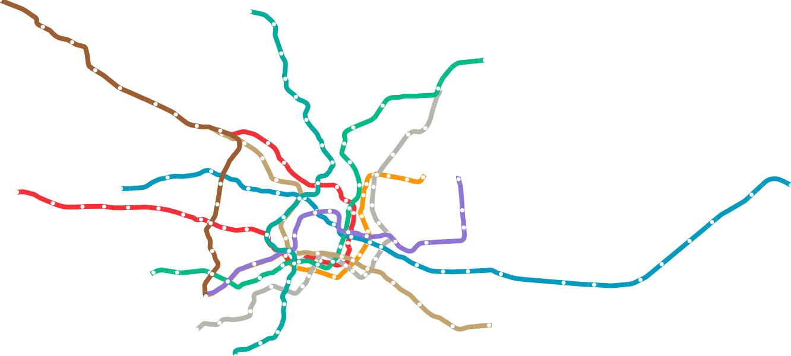
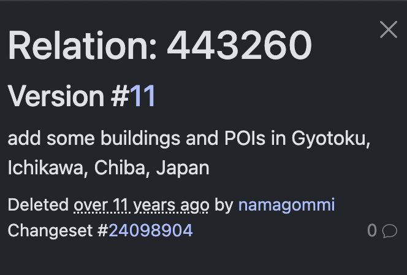
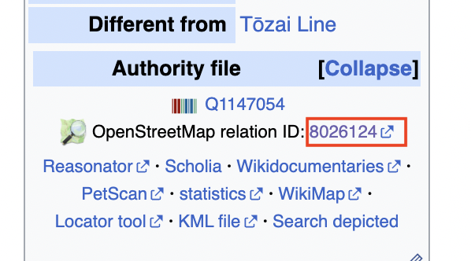
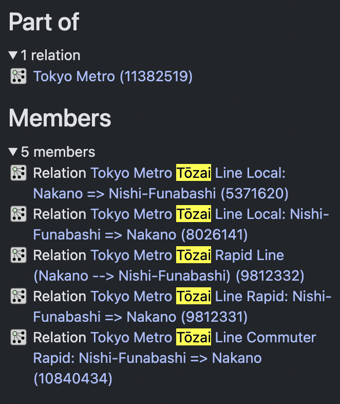

# tokyo-metro 🚇

## Tokyo Metro SVG map



## Lines

<table>
  <tr>
    <th colspan=5><h3>Ginza</h3></th>
  </tr>
  <tr>
    <td></td>
    <td></td>
    <td></td>
    <td></td>
    <td></td>
  </tr>
  <tr>
    <td></td>
    <td></td>
    <td></td>
    <td></td>
    <td></td>
  </tr>
  <tr>
    <td></td>
    <td></td>
    <td></td>
    <td></td>
    <td></td>
  </tr>
  <tr>
    <td></td>
    <td></td>
    <td></td>
    <td></td>
  </tr>
</table>

<table>
  <tr>
    <th colspan=5><h3>Marunouchi</h3></th>
  </tr>
  <tr>
    <td></td>
    <td></td>
    <td></td>
    <td></td>
    <td></td>
  </tr>
  <tr>
    <td></td>
    <td></td>
    <td></td>
    <td></td>
    <td></td>
  </tr>
  <tr>
    <td></td>
    <td></td>
    <td></td>
    <td></td>
    <td></td>
  </tr>
  <tr>
    <td></td>
    <td></td>
    <td></td>
    <td></td>
    <td></td>
  </tr>
  <tr>
    <td></td>
    <td></td>
    <td></td>
    <td></td>
  </tr>
</table>

<table>
  <tr>
    <th colspan=5><h3>Hibiya</h3></th>
  </tr>
  <tr>
    <td></td>
    <td></td>
    <td></td>
    <td></td>
    <td></td>
  </tr>
  <tr>
    <td></td>
    <td></td>
    <td></td>
    <td></td>
    <td></td>
  </tr>
  <tr>
    <td></td>
    <td></td>
    <td></td>
    <td></td>
    <td></td>
  </tr>
  <tr>
    <td></td>
    <td></td>
    <td></td>
    <td></td>
    <td></td>
  </tr>
  <tr>
    <td></td>
    <td></td>
  </tr>
</table>

<table>
  <tr>
    <th colspan=5><h3>Tozai</h3></th>
  </tr>
  <tr>
    <td></td>
    <td></td>
    <td></td>
    <td></td>
    <td></td>
  </tr>
  <tr>
    <td></td>
    <td></td>
    <td></td>
    <td></td>
    <td></td>
  </tr>
  <tr>
    <td></td>
    <td></td>
    <td></td>
    <td></td>
    <td></td>
  </tr>
  <tr>
    <td></td>
    <td></td>
    <td></td>
    <td></td>
    <td></td>
  </tr>
  <tr>
    <td></td>
    <td></td>
  </tr>
</table>

<table>
  <tr>
    <th colspan=5><h3>Chiyoda</h3></th>
  </tr>
  <tr>
    <td></td>
    <td></td>
    <td></td>
    <td></td>
    <td></td>
  </tr>
  <tr>
    <td></td>
    <td></td>
    <td></td>
    <td></td>
    <td></td>
  </tr>
  <tr>
    <td></td>
    <td></td>
    <td></td>
    <td></td>
    <td></td>
  </tr>
  <tr>
    <td></td>
    <td></td>
    <td></td>
    <td></td>
    <td></td>
  </tr>
</table>

<table>
  <tr>
    <th colspan=5><h3>Yurakucho</h3></th>
  </tr>
  <tr>
    <td></td>
    <td></td>
    <td></td>
    <td></td>
    <td></td>
  </tr>
  <tr>
    <td></td>
    <td></td>
    <td></td>
    <td></td>
    <td></td>
  </tr>
  <tr>
    <td></td>
    <td></td>
    <td></td>
    <td></td>
    <td></td>
  </tr>
  <tr>
    <td></td>
    <td></td>
    <td></td>
    <td></td>
    <td></td>
  </tr>
  <tr>
    <td></td>
    <td></td>
    <td></td>
    <td></td>
  </tr>
</table>

<table>
  <tr>
    <th colspan=5><h3>Hanzomon</h3></th>
  </tr>
  <tr>
    <td></td>
    <td></td>
    <td></td>
    <td></td>
    <td></td>
  </tr>
  <tr>
    <td></td>
    <td></td>
    <td></td>
    <td></td>
    <td></td>
  </tr>
  <tr>
    <td></td>
    <td></td>
    <td></td>
    <td></td>
    <td></td>
  </tr>
  <tr>
    <td></td>
    <td></td>
    <td></td>
    <td></td>
    <td></td>
  </tr>
  <tr>
    <td></td>
    <td></td>
  </tr>
</table>

<table>
  <tr>
    <th colspan=5><h3>Namboku</h3></th>
  </tr>
  <tr>
    <td></td>
    <td></td>
    <td></td>
    <td></td>
    <td></td>
  </tr>
  <tr>
    <td></td>
    <td></td>
    <td></td>
    <td></td>
    <td></td>
  </tr>
  <tr>
    <td></td>
    <td></td>
    <td></td>
    <td></td>
    <td></td>
  </tr>
  <tr>
    <td></td>
    <td></td>
    <td></td>
    <td></td>
  </tr>
</table>

<table>
  <tr>
    <th colspan=5><h3>Fukutoshin</h3></th>
  </tr>
  <tr>
    <td></td>
    <td></td>
    <td></td>
    <td></td>
    <td></td>
  </tr>
  <tr>
    <td></td>
    <td></td>
    <td></td>
    <td></td>
    <td></td>
  </tr>
  <tr>
    <td></td>
    <td></td>
    <td></td>
    <td></td>
    <td></td>
  </tr>
  <tr>
    <td></td>
  </tr>
</table>

## Colors

Each Tokyo Metro line has an official color, and they're pretty easy to find.

## OSM relations

This is the [Overpass turbo](https://wiki.openstreetmap.org/wiki/Overpass_turbo)
query I used to fetch the [GeoJSON](https://geojson.org/) relation file for each
Tokyo Metro line.

```
/*
This is an example Overpass query.
Try it out by pressing the Run button above!
You can find more examples with the Load tool.
*/

[out:json][timeout:60];

// Ginza line route relation.
//
// See https://wiki.openstreetmap.org/wiki/Tokyo_Metro for each line's relation.
relation(443281);

// Get all member ways + their nodes
(way(r); >;);

// Dump everything
out body;
```

I used https://wiki.openstreetmap.org/wiki/Tokyo_Metro to get the OSM for each
line, except the Tozai line. That site specified the relation
[`443260`](https://www.openstreetmap.org/relation/443260), but when you click
it, nothing shows up, and the history says it was deleted over 11 years ago.



I then found
https://commons.wikimedia.org/wiki/Category:Tokyo_Metro_T%C5%8Dzai_Line, which
lists the Tozai line relation as
[`8026124`](https://www.openstreetmap.org/relation/8026124).



Unfortunately, fetching this relation yielded no data — an absolutely empty
`export.geojson`. I quickly realized that This is because the relation is just a
container relation, holding the various *sub*-relations for each of the Tozai
line variations: local/rapid/commuter rapid.



I chose the local variant since it listed all the stops; this is relation
[`5371620`](https://www.openstreetmap.org/relation/5371620).

## Line merging

The OSM GeoJSON data gives a ton of disconnected subway line segments (as
`LineString`s), but almost all of them have starting coordinates that match
another segment's *end* coordinates, or vice versa. This gives us an opportunity
to merge as many segments as possible, not only to create a simpler graph
structure, but to reduce visual artifacts in the SVG produced by many separate
`<polyline>`s. See the before and after below:

<table>
  <tr>
    <th>Before line merging</th>
    <th>After line merging</th>
  </tr>
  <tr>
    <td></td>
    <td></td>
  </tr>
</table>

The line merging algorithm right now is pretty simple and dumb; it makes some
assumptions that hold for Tokyo Metro's data set, to avoid complexity.
